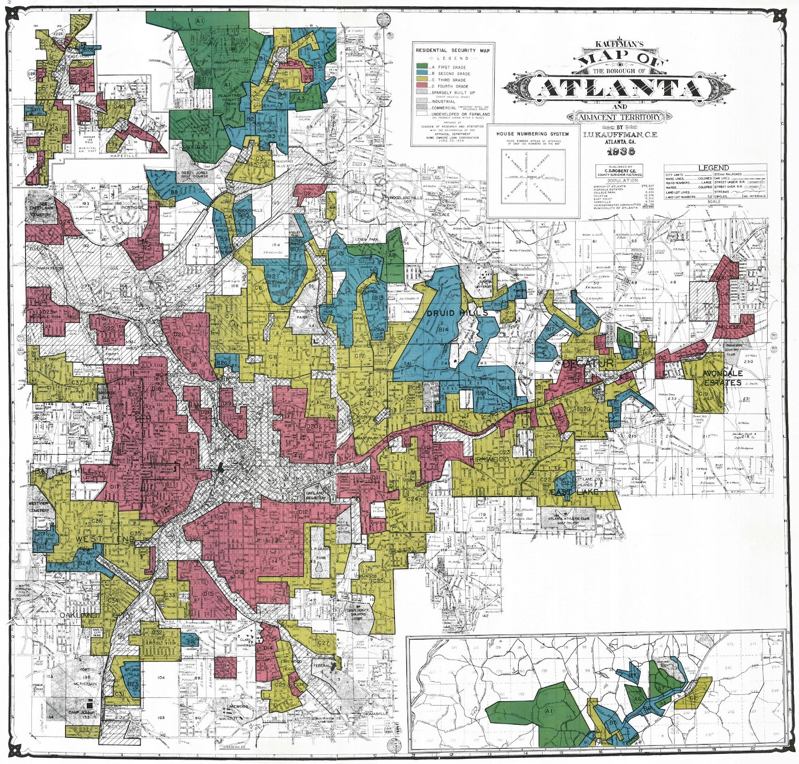
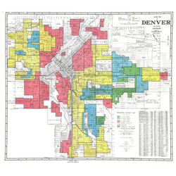
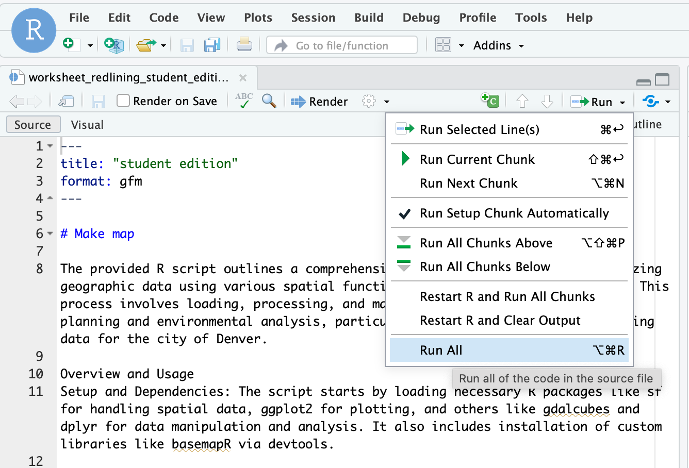

# Exploring Resilience with Data in your Third Space (CyVerse)

## Instructions

Work through the prompts below with the people at your table. Please use a decision-making method *to decide* before moving to a new section of the activity.

## Introductions

Please share the following information with your team:
- Name
- Pronouns 
- Where did you travel from?
- Reflecting back on the polarities exercise, share one thing you observed about yourself. 

## Objectives of this group activity

1. Increase comfort with Cyverse
2. Practice decision-making with a group
3. Get to know other Summit participants
4. Explore how historic policies continue to affect the spatial distribution of environmental amenities.

# Background

## Introduction to Redlining

This group exploration delves into the long-term impacts of historical redlining on urban greenspace, emphasizing the powerful role of maps in shaping environmental and social landscapes. By drawing on the research by Nardone et al. (2021), you will collaboratively investigate how discriminatory practices encoded in maps have led to persistent disparities in urban settings. This exploration aims to uncover the resilience of communities in adapting to these entrenched injustices and to foster a deeper understanding of how mapping can serve both as a tool of exclusion and as a means for promoting social equity.

## Understanding Redlining as a Systemic Disturbance

Redlining originated in the 1930s as a discriminatory practice where the Home Owners' Loan Corporation (HOLC) systematically denied mortgages or offered unfavorable terms based on racial and ethnic compositions. This methodical exclusion, executed through maps that color-coded "risky" investment areas in red, marked minority-populated areas, denying them crucial investment and development opportunities and initiating a profound and lasting disturbance in the urban fabric.

Maps serve as powerful tools beyond navigation; they communicate and enforce control. By defining neighborhood boundaries through redlining, HOLC maps not only mirrored societal biases but also perpetuated and embedded them into the urban landscape. This manipulation of geographic data set a trajectory that limited economic growth, dictated the allocation of services, and influenced the development or deterioration of community infrastructure.

**Figure 1:** 1938 Map of Atlanta uses colors as grades for neighborhoods. The red swaths identify each area with large African-American populations that were deemed “less safe.”

**Explore the Story Map:** Click on the image above to explore the interactive story map about [subject of the story map].

## Resilience and Adaptation in Urban Environments

The legacy of redlining presents both a challenge and an opportunity for resilience and adaptation. Economically and socially, redlining entrenched cycles of poverty and racial segregation, creating a resilient wealth gap that has been difficult to dismantle. Environmentally, the neighborhoods targeted by redlining continue to face significant challenges—they generally feature less greenspace, suffer from higher pollution levels, and are more vulnerable to the impacts of climate change. These factors compound the health and wellness challenges faced by residents.

Despite these adversities, urban communities have continually demonstrated remarkable resilience. Adaptation strategies, such as community-led green initiatives, urban agriculture, and grassroots activism, have emerged as responses to these systemic disturbances. By enhancing green infrastructure and advocating for equitable environmental policies, these communities strive to increase their resilience against both historical inequities and environmental challenges.

The following group exercise will uncover the impact of redlining on urban greenspace and highlight the adaptive strategies developed in response to this enduring disturbance. Through mapping and analysis, we aim to illustrate the powerful role that geographic data can play in understanding and fostering urban resilience and social equity.

### References

- Nardone, A., Rudolph, K. E., Morello-Frosch, R., & Casey, J. A. (2021). Redlines and Greenspace: The Relationship between Historical Redlining and 2010 Greenspace across the United States. *Environmental Health Perspectives*, 129(1), 017006. DOI:10.1289/EHP7495.
- Hoffman, J. S., Shandas, V., & Pendleton, N. (2020). The Effects of Historical Housing Policies on Resident Exposure to Intra-Urban Heat: A Study of 108 US Urban Areas. *Climate*, 8(1), 12. DOI:10.3390/cli8010012.
****************************************

# Group Activity

## Setting up CyVerse 
- Log into [CyVerse](https://de.cyverse.org/)
- Use the [startup procedure](https://cu-esiil.github.io/Innovation-Summit-2024/resources/cyverse_startup/) to start an instance on CyVerse. Be sure to:
    - Create an SSH key and add it to your Github account (2nd half of start-up procedure instructions)
    - Clone the [Innovation-Summit-2024 repository](https://github.com/CU-ESIIL/Innovation-Summit-2024)
    - Complete the [R Studio hack](https://cu-esiil.github.io/Innovation-Summit-2024/additional-resources/cyverse_hacks/)
- Please raise your hand if you have questions or run into technical issues. ESIIL represenatives will be walking around to help.
- Once you initiate your CyVerse instance, **DO NOT close it**. You can keep this instance running the entire Summit so you don't have to do the start-up procedure again.

## Create a Map

We'll be using pre-developed code to visualize redlining impacts on Denver, CO. Please follow these steps: 

- Open R Studio in CyVerse
- Use "files" (lower right) to navigate to this markdown document:
    - **innovation-summit-2024/code/worksheet_redlining_student_edition.qmd**
- Start at the beginning of the code and complete the following:
    - Create a map of historically redlined districts in Denver
    - Overlay current-day NDVI (vegetation greenness) data onto your map
- You can choose "Run All" to run all the code at once. Note: It will take about **5 minutes** to run.

    
- Now, it's your turn to choose a variable to observe. Use the provided code to select the variable you want to add to your map. More detailed instructions are included in the code.

**Variable Options:**

1. Tree inventory
2. Traffic accidents
3. Stream sampling effort
4. Soil sampling effort
5. Public art density
6. Liquor license density
7. Crime density

### Decision-Making
Use the gradient of agreement (Kaner 2014) to make a decision as a team about which variable you want to explore.

## Unique Title
Come up with a unique title for your anaylysis. Write it down on a sticky note at your table. 

## Discussion Questions

After completing your anaylysis, discuss these questions with your group: 

1. What patterns do you notice? What are the immediate questions that come to mind?
2. How does big data help illustrate resilience?
3. Redlining has a long-term impact. How is the impact of redlining still evident today?

## Still have time? 

As a group, choose another variable to explore and then discuss your findings.

### Look through all the variables:

Once you're done, you can see all the code and variable maps on the "Teacher Edition" version of the activity: <https://cu-esiil.github.io/Innovation-Summit-2024/worksheets/worksheet_redlining/>
