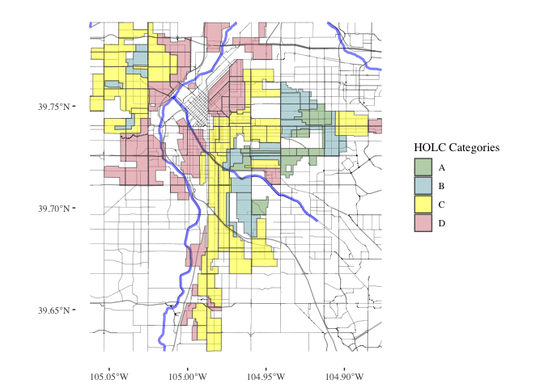
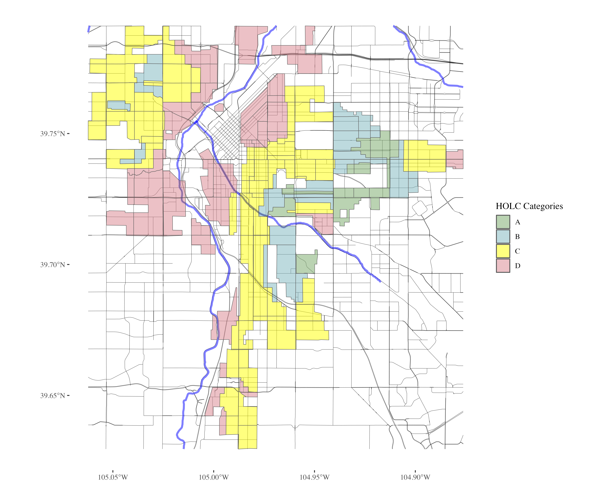
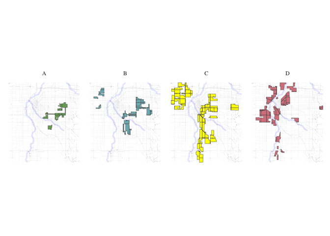
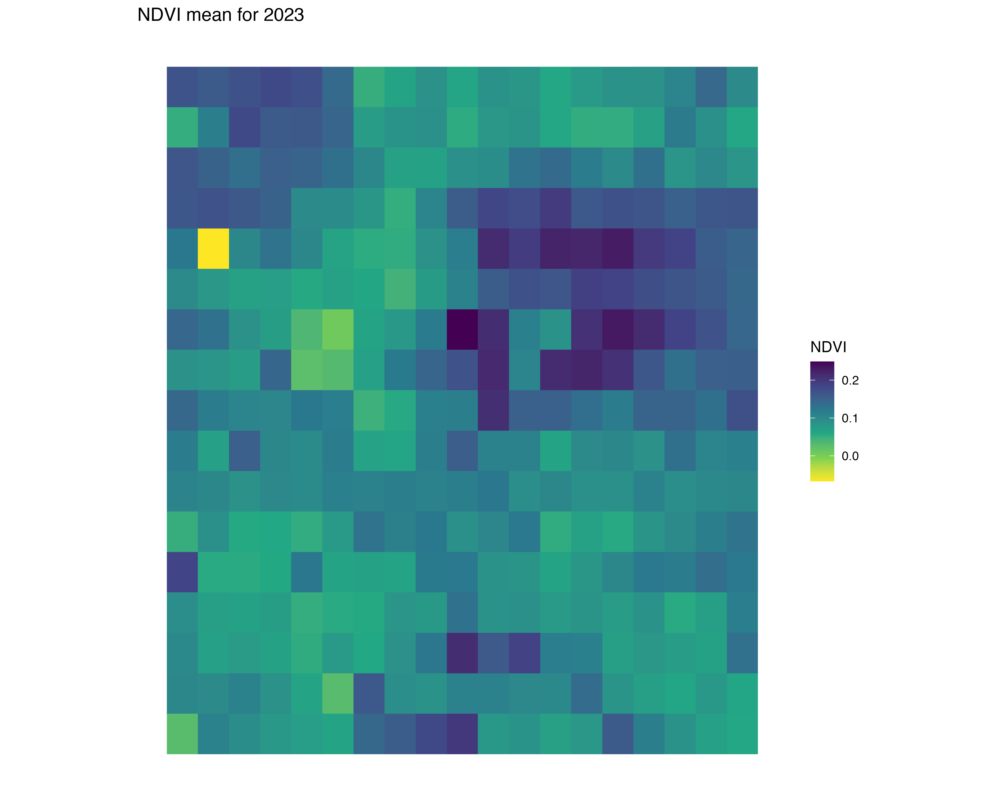
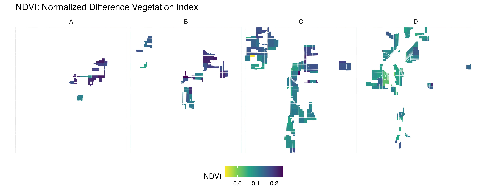
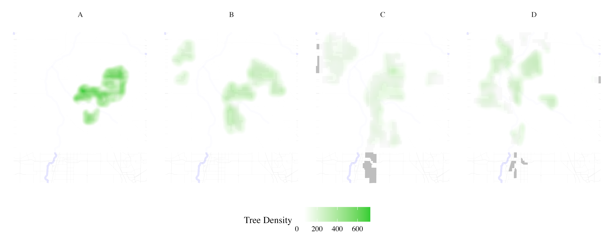
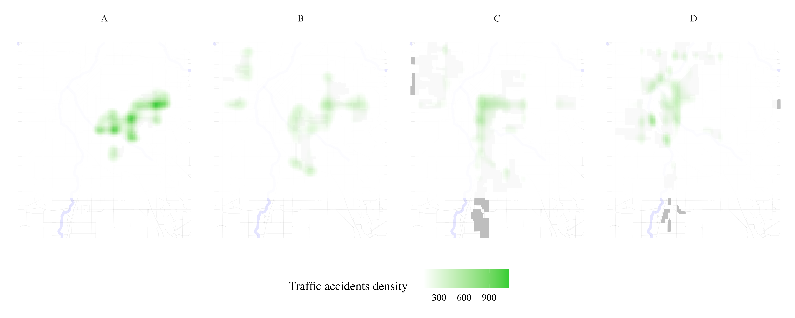
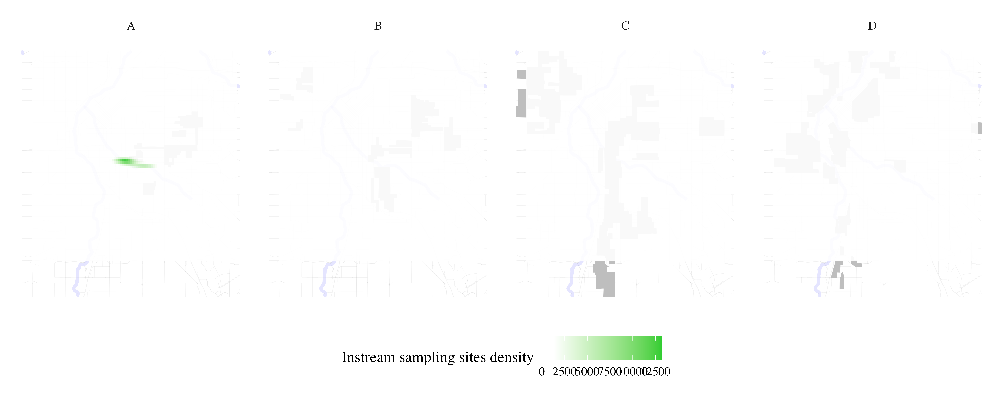
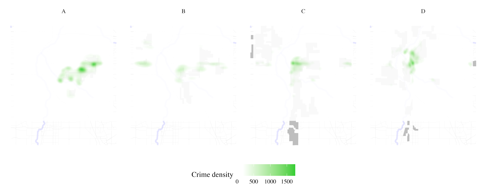

student edition
================

<style>
img {
    width: 100%;
}

details summary {
  color: black;
  background-color: white;
}

details[open] summary {
  color: black; 
}
</style>
<details>
<summary>
R libraries we use in this analysis
</summary>

``` r
if (!requireNamespace("tidytext", quietly = TRUE)) {
  install.packages("tidytext")
}
library(tidytext)
## Warning: package 'tidytext' was built under R version 4.3.2
library(sf)
## Warning: package 'sf' was built under R version 4.3.2
## Linking to GEOS 3.11.0, GDAL 3.5.3, PROJ 9.1.0; sf_use_s2() is TRUE
library(ggplot2)
## Warning: package 'ggplot2' was built under R version 4.3.2
library(ggthemes)
## Warning: package 'ggthemes' was built under R version 4.3.2
library(dplyr)
## 
## Attaching package: 'dplyr'
## The following objects are masked from 'package:stats':
## 
##     filter, lag
## The following objects are masked from 'package:base':
## 
##     intersect, setdiff, setequal, union
library(rstac)
## Warning: package 'rstac' was built under R version 4.3.2
library(gdalcubes)
## Warning: package 'gdalcubes' was built under R version 4.3.2
library(gdalUtils)
## Please note that rgdal will be retired during October 2023,
## plan transition to sf/stars/terra functions using GDAL and PROJ
## at your earliest convenience.
## See https://r-spatial.org/r/2023/05/15/evolution4.html and https://github.com/r-spatial/evolution
## rgdal: version: 1.6-7, (SVN revision 1203)
## Geospatial Data Abstraction Library extensions to R successfully loaded
## Loaded GDAL runtime: GDAL 3.5.3, released 2022/10/21
## Path to GDAL shared files: /Library/Frameworks/R.framework/Versions/4.3-x86_64/Resources/library/rgdal/gdal
##  GDAL does not use iconv for recoding strings.
## GDAL binary built with GEOS: TRUE 
## Loaded PROJ runtime: Rel. 9.1.0, September 1st, 2022, [PJ_VERSION: 910]
## Path to PROJ shared files: /Library/Frameworks/R.framework/Versions/4.3-x86_64/Resources/library/gdalcubes/proj
## PROJ CDN enabled: FALSE
## Linking to sp version:1.6-1
## To mute warnings of possible GDAL/OSR exportToProj4() degradation,
## use options("rgdal_show_exportToProj4_warnings"="none") before loading sp or rgdal.
## 
## Attaching package: 'gdalUtils'
## The following object is masked from 'package:sf':
## 
##     gdal_rasterize
library(gdalcubes)
library(colorspace)
library(terra)
## Warning: package 'terra' was built under R version 4.3.2
## terra 1.7.71
## 
## Attaching package: 'terra'
## The following object is masked from 'package:colorspace':
## 
##     RGB
## The following objects are masked from 'package:gdalcubes':
## 
##     animate, crop, size
library(tidyterra)
## 
## Attaching package: 'tidyterra'
## The following object is masked from 'package:stats':
## 
##     filter
library(basemapR)
library(tidytext)
library(ggwordcloud)
library(osmextract)
## Data (c) OpenStreetMap contributors, ODbL 1.0. https://www.openstreetmap.org/copyright.
## Check the package website, https://docs.ropensci.org/osmextract/, for more details.
library(sf)
library(ggplot2)
library(ggthemes)
library(glue)
## 
## Attaching package: 'glue'
## The following object is masked from 'package:terra':
## 
##     trim

library(purrr)
```

</details>
<details>
<summary>
FUNCTION: Stream HOLC data from a city
</summary>

``` r
# Function to load and filter redlining data by city
load_city_redlining_data <- function(city_name) {
  # URL to the GeoJSON data
  url <- "https://raw.githubusercontent.com/americanpanorama/mapping-inequality-census-crosswalk/main/MIv3Areas_2010TractCrosswalk.geojson"
  
  # Read the GeoJSON file into an sf object
  redlining_data <- read_sf(url)
  
  # Filter the data for the specified city and non-empty grades
  
  city_redline <- redlining_data %>%
    filter(city == city_name )
  
  # Return the filtered data
  return(city_redline)
}
```

</details>
<details>
<summary>
Stream HOLC data for Denver, CO
</summary>

``` r
# Load redlining data for Denver
denver_redlining <- load_city_redlining_data("Denver")
knitr::kable(head(denver_redlining), format = "markdown")
```

| area_id | city   | state | city_survey | cat  | grade | label | res  | com   | ind   | fill     | GEOID10     | GISJOIN        |    calc_area | pct_tract | geometry                     |
|--------:|:-------|:------|:------------|:-----|:------|:------|:-----|:------|:------|:---------|:------------|:---------------|-------------:|----------:|:-----------------------------|
|    6525 | Denver | CO    | TRUE        | Best | A     | A1    | TRUE | FALSE | FALSE | \#76a865 | 08031004104 | G0800310004104 | 1.525535e+01 |   0.00001 | MULTIPOLYGON (((-104.9125 3… |
|    6525 | Denver | CO    | TRUE        | Best | A     | A1    | TRUE | FALSE | FALSE | \#76a865 | 08031004201 | G0800310004201 | 3.987458e+05 |   0.20900 | MULTIPOLYGON (((-104.9246 3… |
|    6525 | Denver | CO    | TRUE        | Best | A     | A1    | TRUE | FALSE | FALSE | \#76a865 | 08031004304 | G0800310004304 | 1.554195e+05 |   0.05927 | MULTIPOLYGON (((-104.9125 3… |
|    6525 | Denver | CO    | TRUE        | Best | A     | A1    | TRUE | FALSE | FALSE | \#76a865 | 08031004202 | G0800310004202 | 1.117770e+06 |   0.57245 | MULTIPOLYGON (((-104.9125 3… |
|    6529 | Denver | CO    | TRUE        | Best | A     | A2    | TRUE | FALSE | FALSE | \#76a865 | 08031004302 | G0800310004302 | 3.133415e+05 |   0.28381 | MULTIPOLYGON (((-104.928 39… |
|    6529 | Denver | CO    | TRUE        | Best | A     | A2    | TRUE | FALSE | FALSE | \#76a865 | 08031004301 | G0800310004301 | 1.221218e+05 |   0.08622 | MULTIPOLYGON (((-104.9305 3… |

</details>
<details>
<summary>
FUNCTION: Get Points-of-Interest from city of interest
</summary>

``` r


get_places <- function(polygon_layer, type = "food" ) {
  # Check if the input is an sf object
  if (!inherits(polygon_layer, "sf")) {
    stop("The provided object is not an sf object.")
  }
  
  # Create a bounding box from the input sf object
  bbox_here <- st_bbox(polygon_layer) |>
    st_as_sfc()
 
   if(type == "roads"){
    my_layer <- "lines"
    my_query <- "SELECT * FROM lines WHERE (
             highway IN ('motorway', 'trunk', 'primary', 'secondary', 'tertiary') )"
    title <- "Major roads"
   }
  
  if(type == "rivers"){
    my_layer <- "lines"
    my_query <- "SELECT * FROM lines WHERE (
             waterway IN ('river'))"
    title <- "Major rivers"
  }
 


  # Use the bbox to get data with oe_get(), specifying the desired layer and a custom SQL query for fresh food places
  tryCatch({
    places <- oe_get(
      place = bbox_here,
      layer = my_layer,  # Adjusted layer; change as per actual data availability
      query = my_query,
      quiet = TRUE
    )
    
  places <- st_make_valid(places)
    
    # Crop the data to the bounding box
    cropped_places <- st_crop(places, bbox_here)
    
    # Plotting the cropped fresh food places
    plot <- ggplot(data = cropped_places) +
      geom_sf(fill="cornflowerblue", color="cornflowerblue") +
      ggtitle(title) +
  theme_tufte()+
  theme(legend.position = "none",  # Optionally hide the legend
        axis.text = element_blank(),     # Remove axis text
        axis.title = element_blank(),    # Remove axis titles
        axis.ticks = element_blank(),    # Remove axis ticks
         plot.background = element_rect(fill = "white", color = NA),  # Set the plot background to white
        panel.background = element_rect(fill = "white", color = NA),  # Set the panel background to white
        panel.grid.major = element_blank(),  # Remove major grid lines
        panel.grid.minor = element_blank(),
        ) 
    
    # Save the plot as a PNG file
    png_filename <- paste0(title,"_", Sys.Date(), ".png")
    ggsave(png_filename, plot, width = 10, height = 8, units = "in")
    
    # Return the cropped dataset
    return(cropped_places)
  }, error = function(e) {
    stop("Failed to retrieve or plot data: ", e$message)
  })
}
```

</details>
<details>
<summary>
Stream amenities by category
</summary>

``` r
roads <- get_places(denver_redlining, type="roads")

rivers <- get_places(denver_redlining, type="rivers")
```

</details>
<details>
<summary>
FUNCTION: Plot POI over HOLC grades
</summary>

``` r


plot_city_redlining <- function(redlining_data, filename = "redlining_plot.png") {
  # Fetch additional geographic data based on redlining data
  roads <- get_places(redlining_data, type = "roads")
  rivers <- get_places(redlining_data, type = "rivers")
  
  # Filter residential zones with valid grades and where city survey is TRUE
  residential_zones <- redlining_data %>%
    filter(city_survey == TRUE & grade != "") 

  # Colors for the grades
  colors <- c("#76a865", "#7cb5bd", "#ffff00", "#d9838d")

  # Plot the data using ggplot2
  plot <- ggplot() +
    geom_sf(data = roads, lwd = 0.1) +
    geom_sf(data = rivers, color = "blue", alpha = 0.5, lwd = 1.1) +
    geom_sf(data = residential_zones, aes(fill = grade), alpha = 0.5) +
    theme_tufte() +
    scale_fill_manual(values = colors) +
    labs(fill = 'HOLC Categories') +
    theme(
      plot.background = element_rect(fill = "white", color = NA),
      panel.background = element_rect(fill = "white", color = NA),
      panel.grid.major = element_blank(),
      panel.grid.minor = element_blank(),
      legend.position = "right"
    )
  
  # Save the plot as a high-resolution PNG file
  ggsave(filename, plot, width = 10, height = 8, units = "in", dpi = 600)
  
  # Return the plot object if needed for further manipulation or checking
  return(plot)
}
```

</details>
<details>
<summary>
FUNCTION: Plot the HOLC grades individually
</summary>

``` r
split_plot <- function(sf_data, roads, rivers) {
  # Filter for grades A, B, C, and D
  sf_data_filtered <- sf_data %>% 
    filter(grade %in% c('A', 'B', 'C', 'D'))

  # Define a color for each grade
  grade_colors <- c("A" = "#76a865", "B" = "#7cb5bd", "C" = "#ffff00", "D" = "#d9838d")

  # Create the plot with panels for each grade
  plot <- ggplot(data = sf_data_filtered) +
    geom_sf(data = roads, alpha = 0.1, lwd = 0.1) +
    geom_sf(data = rivers, color = "blue", alpha = 0.1, lwd = 1.1) +
    geom_sf(aes(fill = grade)) +
    facet_wrap(~ grade, nrow = 1) +  # Free scales for different zoom levels if needed
    scale_fill_manual(values = grade_colors) +
    theme_minimal() +
    labs(fill = 'HOLC Grade') +
    theme_tufte() +
    theme(plot.background = element_rect(fill = "white", color = NA),
          panel.background = element_rect(fill = "white", color = NA),
          legend.position = "none",  # Optionally hide the legend
          axis.text = element_blank(),     # Remove axis text
          axis.title = element_blank(),    # Remove axis titles
          axis.ticks = element_blank(),    # Remove axis ticks
          panel.grid.major = element_blank(),  # Remove major grid lines
          panel.grid.minor = element_blank())  

  ggsave(plot, filename = "HOLC_grades_individually.png", width = 10, height = 4, units = "in", dpi = 1200)
  return(plot)
}
```

</details>
<details>
<summary>
Plot Denver Redlining
</summary>

``` r
denver_plot <- plot_city_redlining(denver_redlining)
denver_plot
```



</details>



<details>
<summary>
Plot 4 HOLC grades individually
</summary>

``` r
plot_row <- split_plot(denver_redlining, roads, rivers)
plot_row
```



</details>


<details>
<summary>
FUNCTION: Map an amenity over each grade individually
</summary>

``` r

process_and_plot_sf_layers <- function(layer1, layer2, output_file = "output_plot.png") {
 # Make geometries valid
layer1 <- st_make_valid(layer1)
layer2 <- st_make_valid(layer2)

# Optionally, simplify geometries to remove duplicate vertices
layer1 <- st_simplify(layer1, preserveTopology = TRUE) |>
  filter(grade != "")

# Prepare a list to store results
results <- list()

# Loop through each grade and perform operations
for (grade in c("A", "B", "C", "D")) {
  # Filter layer1 for current grade
  layer1_grade <- layer1[layer1$grade == grade, ]

  # Buffer the geometries of the current grade
  buffered_layer1_grade <- st_buffer(layer1_grade, dist = 500)

  # Intersect with the second layer
  intersections <- st_intersects(layer2, buffered_layer1_grade, sparse = FALSE)
  selected_polygons <- layer2[rowSums(intersections) > 0, ]

  # Add a new column to store the grade information
  selected_polygons$grade <- grade

  # Store the result
  results[[grade]] <- selected_polygons
}

# Combine all selected polygons from different grades into one sf object
final_selected_polygons <- do.call(rbind, results)

  # Define colors for the grades
  grade_colors <- c("A" = "grey", "B" = "grey", "C" = "grey", "D" = "grey")

  # Create the plot
  plot <- ggplot() +
    geom_sf(data = roads, alpha = 0.05, lwd = 0.1) +
    geom_sf(data = rivers, color = "blue", alpha = 0.1, lwd = 1.1) +
    geom_sf(data = layer1, fill = "grey", color = "grey", size = 0.1) +
    facet_wrap(~ grade, nrow = 1) +
    geom_sf(data = final_selected_polygons,fill = "green", color = "green", size = 0.1) +
    facet_wrap(~ grade, nrow = 1) +
    #scale_fill_manual(values = grade_colors) +
    #scale_color_manual(values = grade_colors) +
    theme_minimal() +
    labs(fill = 'HOLC Grade') +
    theme_tufte() +
    theme(plot.background = element_rect(fill = "white", color = NA),
      panel.background = element_rect(fill = "white", color = NA),
      legend.position = "none",
          axis.text = element_blank(),
          axis.title = element_blank(),
          axis.ticks = element_blank(),
          panel.grid.major = element_blank(),
          panel.grid.minor = element_blank())

  # Save the plot as a high-resolution PNG file
  ggsave(output_file, plot, width = 10, height = 4, units = "in", dpi = 1200)
  
  # Return the plot for optional further use
  return(list(plot=plot, sf = final_selected_polygons))
}
```

</details>

## Part 2: Integrating Environmental Data

### Data Processing

-   Use satellite data from 2010 to analyze greenspace using NDVI, an
    index that measures the quantity of vegetation in an area.
-   Apply methods to adjust for potential confounders as described in
    the study, ensuring that comparisons of greenspace across HOLC
    grades are valid and not biased by historical or socio-demographic
    factors.

<details>
<summary>
FUNCTION: Stream NDVI data
</summary>

``` r
polygon_layer <- denver_redlining
# Function to process satellite data based on an SF polygon's extent
process_satellite_data <- function(polygon_layer, start_date, end_date, assets, fps = 1, output_file = "anim.gif") {
  # Record start time
  start_time <- Sys.time()
  
  # Calculate the bbox from the polygon layer
  bbox <- st_bbox(polygon_layer)
  
  s = stac("https://earth-search.aws.element84.com/v0")

  
  # Use stacR to search for Sentinel-2 images within the bbox and date range
  items = s |> stac_search(
    collections = "sentinel-s2-l2a-cogs",
    bbox = c(bbox["xmin"], bbox["ymin"], bbox["xmax"], bbox["ymax"]),
    datetime = paste(start_date, end_date, sep = "/"),
    limit = 500
  ) %>% 
  post_request()
  
  # Define mask for Sentinel-2 image quality
  #S2.mask <- image_mask("SCL", values = c(3, 8, 9))
  
  # Create a collection of images filtering by cloud cover
  col <- stac_image_collection(items$features, asset_names = assets, property_filter = function(x) {x[["eo:cloud_cover"]] < 30})
  
  # Define a view for processing the data
  v <- cube_view(srs = "EPSG:4326", 
                 extent = list(t0 = start_date, t1 = end_date,
                               left = bbox["xmin"], right = bbox["xmax"], 
                               top = bbox["ymax"], bottom = bbox["ymin"]),
                 dx = 0.001, dy = 0.001, dt = "P1M", 
                 aggregation = "median", resampling = "bilinear")
  
  # Calculate NDVI and create an animation
  ndvi_col <- function(n) {
    rev(sequential_hcl(n, "Green-Yellow"))
  }
  
  #raster_cube(col, v, mask = S2.mask) %>%
  raster_cube(col, v) %>%
    select_bands(c("B04", "B08")) %>%
    apply_pixel("(B08-B04)/(B08+B04)", "NDVI") %>%
    gdalcubes::animate(col = ndvi_col, zlim = c(-0.2, 1), key.pos = 1, save_as = output_file, fps = fps)
  
  # Calculate processing time
  end_time <- Sys.time()
  processing_time <- difftime(end_time, start_time)
  
  # Return processing time
  return(processing_time)
}
```

</details>
<details>
<summary>
Stream NDVI data: animation
</summary>

``` r
processing_time <- process_satellite_data(denver_redlining, "2022-05-31", "2023-05-31", c("B04", "B08"))
```

</details>


<details>
<summary>
FUNCTION: Map NDVI per HOLC grade individually
</summary>

``` r


create_mask_and_plot <- function(redlining_sf, background_raster = ndvi$raster, roads = NULL, rivers = NULL){
  start_time <- Sys.time()  # Start timing
  
  # Validate and prepare the redlining data
  redlining_sf <- redlining_sf %>%
    filter(grade != "") %>%
    st_make_valid()
  
  
bbox <- st_bbox(redlining_sf)  # Get original bounding box


expanded_bbox <- expand_bbox(bbox, 6000, 1000)  # 

   
expanded_bbox_poly <- st_as_sfc(expanded_bbox, crs = st_crs(redlining_sf)) %>%
    st_make_valid()
  
  # Initialize an empty list to store masks
  masks <- list()
  
  # Iterate over each grade to create masks
  unique_grades <- unique(redlining_sf$grade)
  for (grade in unique_grades) {
    # Filter polygons by grade
    grade_polygons <- redlining_sf[redlining_sf$grade == grade, ]
    
    # Create an "inverted" mask by subtracting these polygons from the background
    mask <- st_difference(expanded_bbox_poly, st_union(grade_polygons))
    
    # Store the mask in the list with the grade as the name
    masks[[grade]] <- st_sf(geometry = mask, grade = grade)
  }
  
  # Combine all masks into a single sf object
  mask_sf <- do.call(rbind, masks)
  
  # Normalize the grades so that C.2 becomes C, but correctly handle other grades
  mask_sf$grade <- ifelse(mask_sf$grade == "C.2", "C", mask_sf$grade)

  # Prepare the plot
  plot <- ggplot() +
    geom_spatraster(data = background_raster, aes(fill = NDVI)) +
  scale_fill_viridis_c(name = "NDVI", option = "viridis", direction = -1) +
   
    geom_sf(data = mask_sf, aes(color = grade), fill = "white", size = 0.1, show.legend = FALSE) +
    scale_color_manual(values = c("A" = "white", "B" = "white", "C" = "white", "D" = "white"), name = "Grade") +
    facet_wrap(~ grade, nrow = 1) +
     geom_sf(data = roads, alpha = 1, lwd = 0.1, color="white") +
    geom_sf(data = rivers, color = "white", alpha = 0.5, lwd = 1.1) +
    labs(title = "NDVI: Normalized Difference Vegetation Index") +
    theme_minimal() +
    coord_sf(xlim = c(bbox["xmin"], bbox["xmax"]), 
           ylim = c(bbox["ymin"], bbox["ymax"]), 
           expand = FALSE) + 
    theme(plot.background = element_rect(fill = "white", color = NA),
          panel.background = element_rect(fill = "white", color = NA),
          legend.position = "bottom",
          axis.text = element_blank(),
          axis.title = element_blank(),
          axis.ticks = element_blank(),
          panel.grid.major = element_blank(),
          panel.grid.minor = element_blank())

  # Save the plot
  ggsave("redlining_mask_ndvi.png", plot, width = 10, height = 4, dpi = 600)

  end_time <- Sys.time()  # End timing
  runtime <- end_time - start_time

  # Return the plot and runtime
  return(list(plot = plot, runtime = runtime, mask_sf = mask_sf))
}
```

</details>
<details>
<summary>
FUNCTION: Stream year average NDVI
</summary>

``` r


yearly_average_ndvi <- function(polygon_layer, output_file = "ndvi.png", dx = 0.01, dy = 0.01) {
  # Record start time
  start_time <- Sys.time()

  # Calculate the bbox from the polygon layer
  bbox <- st_bbox(polygon_layer)
  
  s = stac("https://earth-search.aws.element84.com/v0")

  # Search for Sentinel-2 images within the bbox for June
  items <- s |> stac_search(
    collections = "sentinel-s2-l2a-cogs",
    bbox = c(bbox["xmin"], bbox["ymin"], bbox["xmax"], bbox["ymax"]),
    datetime = "2023-01-01/2023-12-31",
    limit = 500
  ) %>% 
  post_request()
  
  # Create a collection of images filtering by cloud cover
  col <- stac_image_collection(items$features, asset_names = c("B04", "B08"), property_filter = function(x) {x[["eo:cloud_cover"]] < 80})
  
  # Define a view for processing the data specifically for June
  v <- cube_view(srs = "EPSG:4326", 
                 extent = list(t0 = "2023-01-01", t1 = "2023-12-31",
                               left = bbox["xmin"], right = bbox["xmax"], 
                               top = bbox["ymax"], bottom = bbox["ymin"]),
                 dx = dx, dy = dy, dt = "P1Y", 
                 aggregation = "median", resampling = "bilinear")

  # Process NDVI
  ndvi_rast <- raster_cube(col, v) %>%
    select_bands(c("B04", "B08")) %>%
    apply_pixel("(B08-B04)/(B08+B04)", "NDVI") %>%
    write_tif() |>
    terra::rast()
  
 
  # Convert terra Raster to ggplot using tidyterra
ndvi_plot <-   ggplot() +
    geom_spatraster(data = ndvi_rast, aes(fill = NDVI)) +
    scale_fill_viridis_c(option = "viridis", direction = -1, name = "NDVI") +
    labs(title = "NDVI mean for 2023") +
    theme_minimal() +
    coord_sf() +
    theme(plot.background = element_rect(fill = "white", color = NA),
      panel.background = element_rect(fill = "white", color = NA),
      legend.position = "right",
          axis.text = element_blank(),
          axis.title = element_blank(),
          axis.ticks = element_blank(),
          panel.grid.major = element_blank(),
          panel.grid.minor = element_blank()) 

  # Save the plot as a high-resolution PNG file
  ggsave(output_file, ndvi_plot, width = 10, height = 8, dpi = 600)

  # Calculate processing time
  end_time <- Sys.time()
  processing_time <- difftime(end_time, start_time)

  # Return the plot and processing time
  return(list(plot = ndvi_plot, processing_time = processing_time, raster = ndvi_rast))
}
```

</details>
<details>
<summary>
Stream NDVI: low resolution
</summary>

``` r
ndvi_background_low <- yearly_average_ndvi(denver_redlining)
```

</details>

<details>
<summary>
Map low resolution NDVI per HOLC grade
</summary>

``` r
ndvi <- create_mask_and_plot(denver_redlining, background_raster = ndvi_background_low$raster, roads = roads, rivers = rivers)
```

</details>



<details>
<summary>
FUNCTION: Map Denver City provided data per HOLC grade
</summary>

``` r
process_city_inventory_data <- function(address, inner_file, polygon_layer, output_filename,variable_label= 'Tree Density') {
  # Download and read the shapefile
  full_path <- glue("/vsizip/vsicurl/{address}/{inner_file}")
  shape_data <- st_read(full_path, quiet = TRUE) |> st_as_sf()

  # Process the shape data with the provided polygon layer
  processed_data <- process_and_plot_sf_layers(polygon_layer, shape_data, paste0(output_filename, ".png"))

  # Extract trees from the processed data
  trees <- processed_data$sf
  denver_redlining_residential <- polygon_layer |> filter(grade != "")

  # Generate the density plot
  plot <- ggplot() +
    geom_sf(data = roads, alpha = 0.05, lwd = 0.1) +
    geom_sf(data = rivers, color = "blue", alpha = 0.1, lwd = 1.1) +
    geom_sf(data = denver_redlining_residential, fill = "grey", color = "grey", size = 0.1) +
    facet_wrap(~ grade, nrow = 1) +
    stat_density_2d(data = trees, 
                    mapping = aes(x = map_dbl(geometry, ~.[1]),
                                  y = map_dbl(geometry, ~.[2]),
                                  fill = stat(density)),
                    geom = 'tile',
                    contour = FALSE,
                    alpha = 0.9) +
    scale_fill_gradientn(colors = c("transparent", "white", "limegreen"),
                         values = scales::rescale(c(0, 0.1, 1)),  # Adjust these based on your density range
                         guide = "colourbar") +
    theme_minimal() +
    labs(fill = variable_label) +
    theme_tufte() +
    theme(plot.background = element_rect(fill = "white", color = NA),
          panel.background = element_rect(fill = "white", color = NA),
          legend.position = "bottom",
          axis.text = element_blank(),
          axis.title = element_blank(),
          axis.ticks = element_blank(),
          panel.grid.major = element_blank(),
          panel.grid.minor = element_blank())

  # Save the plot
  ggsave(paste0(output_filename, "_density_plot.png"), plot, width = 10, height = 4, units = "in", dpi = 600)

  # Return the plot and the tree layer
  return(list(plot = plot, layer = trees))
}
```

</details>
<details>
<summary>
Map tree inventory per HOLC grade
</summary>

``` r
result <- process_city_inventory_data(
  "https://www.denvergov.org/media/gis/DataCatalog/tree_inventory/shape/tree_inventory.zip",
  "tree_inventory.shp",
  denver_redlining,
  "Denver_tree_inventory_2023"
)
```

    Warning: `stat(density)` was deprecated in ggplot2 3.4.0.
    ℹ Please use `after_stat(density)` instead.

</details>




<details>
<summary>
Map traffic accidents per HOLC grade
</summary>

``` r
result <- process_city_inventory_data(
  "https://www.denvergov.org/media/gis/DataCatalog/traffic_accidents/shape/traffic_accidents.zip",
  "traffic_accidents.shp",
  denver_redlining,
  "Denver_traffic_accidents",
  variable_label= 'Traffic accidents density'
)
```

</details>




<details>
<summary>
Map stream sampling effort per HOLC grade
</summary>

``` r
instream_sampling_sites <- process_city_inventory_data(
  "https://www.denvergov.org/media/gis/DataCatalog/instream_sampling_sites/shape/instream_sampling_sites.zip",
  "instream_sampling_sites.shp",
  denver_redlining,
  "instream_sampling_sites",
  variable_label= 'Instream sampling sites density'
)
```

</details>




<details>
<summary>
Map soil sampling effort per HOLC grade
</summary>

``` r
soil_samples <- process_city_inventory_data(
  "https://www.denvergov.org/media/gis/DataCatalog/soil_samples/shape/soil_samples.zip",
  "soil_samples.shp",
  denver_redlining,
  "Soil samples",
  variable_label= 'soil samples density'
)
```

</details>


<details>
<summary>
Map public art density per HOLC grade
</summary>

``` r
public_art <- process_city_inventory_data(
  "https://www.denvergov.org/media/gis/DataCatalog/public_art/shape/public_art.zip",
  "public_art.shp",
  denver_redlining,
  "Public art ",
  variable_label= 'Public art density'
)
```

</details>


<details>
<summary>
Map liquor licenses density per HOLC grade
</summary>

``` r
liquor_licenses <- process_city_inventory_data(
  "https://www.denvergov.org/media/gis/DataCatalog/liquor_licenses/shape/liquor_licenses.zip",
  "liquor_licenses.shp",
  denver_redlining,
  "liquor licenses ",
  variable_label= 'liquor licenses density'
)
```

</details>


<details>
<summary>
Map crime density per HOLC grade
</summary>

``` r
Crime <- process_city_inventory_data(
  "https://www.denvergov.org/media/gis/DataCatalog/crime/shape/crime.zip",
  "crime.shp",
  denver_redlining,
  "crime",
  variable_label= 'Crime density'
)
```

</details>

 

<details>
<summary>
Map police shooting density per HOLC grade
</summary>

``` r
Denver_police_shootings <- process_city_inventory_data(
  "https://www.denvergov.org/media/gis/DataCatalog/denver_police_officer_involved_shootings/shape/denver_police_officer_involved_shootings.zip",
  "denver_police_officer_involved_shootings.shp",
  denver_redlining,
  "Police shootings",
  variable_label= 'Police shootings density'
)
```

</details>


## Part 3: Comparative Analysis and Visualization

### Statistical Analysis

-   Conduct a detailed statistical analysis to compare greenspace across
    different HOLC grades, using techniques like Targeted Maximum
    Likelihood Estimation (TMLE) to assess the association between
    historical redlining and current greenspace levels.
-   Visualize the disparities in greenspace distribution using GIS
    tools, highlighting how redlining has shaped urban ecological
    landscapes.

## Conclusion

This tutorial provides tools and methodologies to explore the lingering
effects of historic redlining on urban greenspace, offering insights
into the intersection of urban planning, environmental justice, and
public health.

### References

-   Nardone, A., Rudolph, K. E., Morello-Frosch, R., & Casey, J. A.
    (2021). Redlines and Greenspace: The Relationship between Historical
    Redlining and 2010 Greenspace across the United States.
    *Environmental Health Perspectives*, 129(1), 017006.
    DOI:10.1289/EHP7495. [Available
    online](https://www.ncbi.nlm.nih.gov/pmc/articles/PMC7839347/pdf/ehp7495.pdf)
