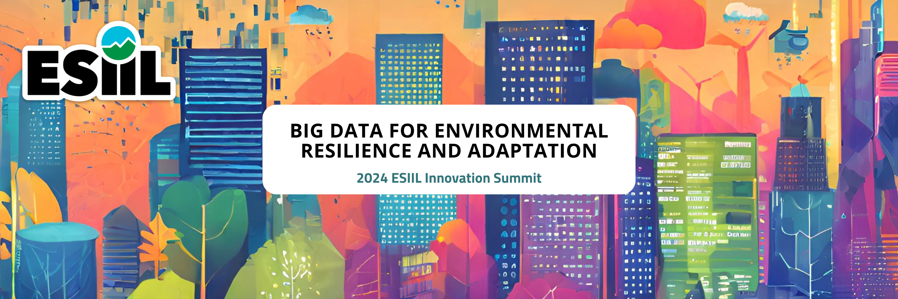

# Group 9 -- Incorporating Traditional Ecological Knowledge (TEK) in decision-making
Summary:
The team introductions included members of the existing ESIIL working groups. We have people with a significant number of superpowers in AI, data processing, computer systems, collaborative work, data collection, mapping, coding, engineering, wireless interconnection hardware and software, and climate data. There are observations about how to communicate climate challenges to traditional communities and how to explain ecological knowledge, as this traditional knowledge in most of the communities is passed through traditions instead of a system-based structure. The concept of cosmos and traditional knowledge is integral and interconnected, and the general idea is to guide people to a living purpose. 
Traditional knowledge includes practices, memorization, oral languages and traditional interactions and many other intangibles. 

!!! Success "Provocative question"
Main discussion: The main discussion was about protecting and preserving traditional and inherent language(s) and other holistic knowledge through data sovereignty. 

    Title: Protecting and Preserving Traditional and Inherent Knowledge through Data Sovereignty. 

    Question: How do we create a sovereign data environment? 

    Mission Statement: 
    We will create a sovereign data environment through remembering our ancestor's teachings and guiding the next Seven Generations     through the development of a colloboration of an     
    Intertribal Data Sovereignty Coalition. 

    Vision Statement: 
    Healing our Nations by embracing our ways of life. 

    Next steps: connect to other groups/orgs/nations that deal with data sovereignty at all levels - Tribes, TCUs, organizations,       and groups. 

    What's missing: We would like to see a Data Sovereignty conference that brings together as many groups as possible for 
    consensus building. For that to happen, we need meeting space, infrastructure, and funding. 
    

